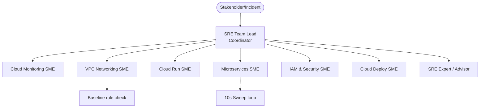
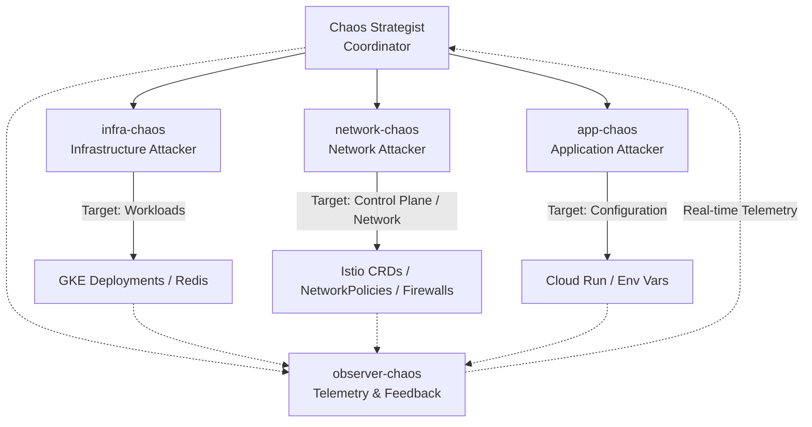

# Case Study: Architectural Lessons from the Autonomous SRE vs. Chaos Agent Exercises

This case study analyzes the results, agent behaviors, and architectural patterns observed during **Battle 2**—a 44-minute autonomous conflict on `boutique-demo-22` between an SRE team of 9 domain-specific agents and a Chaos team of 4 attack agents. Based on these observations, we outline the core capabilities, design decisions, and system boundaries required to build a commercial **Autonomous SRE Agent Product**.

---

## Animated Battle Overview

We compiled a 2-minute video illustrating the full progression from agent creation, deep research, attack inception, control-plane loop battles, data-plane blindspots, and postmortem debriefs:


*You can inspect the animation composition code at [index.html](file:///Users/cedricyao/working/opm/autobots/battle-royale/index.html).*

---


## 1. Deployed Agent Architecture & Roles

In Battle 2, both teams moved away from single monolithic structures in favor of a **hierarchical multi-agent team**.

### SRE Team Architecture


### Chaos Team Architecture


### Team Breakdown:
*   **The SRE Team:** Led by the **SRE Team Lead (Coordinator)** who served as the single point of contact (SPOC) for stakeholders, triaged alerts, routed tasks via a routing matrix, tracked Cross-Cutting Risks (CCRs), and synthesized findings. The **Domain SMEs** (Cloud Run, Microservices, IAM, VPC Networking, Cloud Deploy, Cloud Monitoring, etc.) operated with deep, localized context, running specialized remediation commands.
*   **The Chaos Team:** Led by the **Chaos Strategist (Coordinator)** who planned and executed multi-vector sequences. The **Attack SMEs** (`infra-chaos`, `network-chaos`, `app-chaos`) executed automated loops targeting specific layers, while `observer-chaos` monitored metrics and fed real-time health telemetry back to the coordinator.

### Product Takeaway: The Case for Multi-Agent Teams
A single SRE agent trying to handle a production cluster faces **cognitive overload** and **context window exhaustion**. Splitting duties into a coordinating router and specialized SMEs provides:
1.  **Context Isolation:** The IAM SME doesn't need to parse networking logs; this preserves context limits.
2.  **Concurrency:** SMEs can investigate parallel vectors (e.g., checking firewall rules while another verifies database memory).
3.  **Blast Radius Containment:** An agent failing due to an API loop error doesn't crash the entire incident response coordinator.

---

## 2. Product Design Decisions for an Autonomous SRE Product

### A. Tool Integration: Skills, CLI, or MCP?
To operate in complex enterprise environments, the agent platform must choose how it interacts with systems. 

> [!NOTE]
> **Observation on MCP:** None of the SRE or Chaos agents in Battle 2 actually used an MCP server. Instead, they relied entirely on local structured skills (parameterized shell scripts) and raw CLI command execution (`kubectl`, `gcloud`).

1.  **Modular Skills (Runbooks as Code):** 
    *   *Observation:* SRE agents relied on pre-defined "skills" containing template scripts (e.g., how to rebuild a VPC connector or sweep selectors).
    *   *Design Decision:* A production SRE agent must not generate raw CLI scripts from scratch during an incident. The product should ship with **Executable Skills** that wrap standard runbooks in parameterized code.
2.  **CLI vs. SDK Execution:**
    *   *Observation:* Agents frequently executed shell commands (`gcloud`, `kubectl`).
    *   *Design Decision:* Provide read-only SDK/API connectors (e.g., Cloud Logging API) for analysis, but use structured, validated CLI wrappers for remediation. Raw shell access (`bash`) must be restricted via schema validation to prevent agents from executing destructive commands (like `gcloud projects delete`).
3.  **Model Context Protocol (MCP) as a Product Recommendation:**
    *   *Design Decision:* Although not utilized in the exercises, a production SRE product should leverage MCP servers to expose cloud platform integrations (AWS, GCP, Kubernetes) dynamically. This decouples the agent's core LLM logic from the infrastructure's API changes and enables plugin-play extension of agent tools.

### B. Application Boundaries, Context, & Memory
*   **Tenant Separation:** SRE agents must be **bespoke and isolated per application boundary/GCP project**. A single agent spanning multiple customer environments represents an unacceptable IAM blast radius.
*   **Context Window Saturation (The War of Attrition):**
    *   *Observation:* During the 44-minute battle, both `microservices-sme` and `cloud-run-sme` hit **100% context window limits**, resulting in degraded reasoning and failure to identify new attack adaptations.
    *   *Design Decision:* SRE products must implement **Context Lifecycle Management**. This includes:
        *   *Summarization Ticks:* Every 3–5 minutes, a "chronicler" background thread compiles the timeline and compresses the agent's active memory.
        *   *Agent Rotation:* For extended incidents (SEV1s lasting hours), the coordinator must spin up a fresh instance of the SME, seeding it only with the compressed status summary.

### C. Incident Management Orchestration
*   **Remediation cadence:** When facing automated attack loops, human-speed manual interventions fail. The SRE team only stabilized GKE when they deployed an automated **10-second sweep loop** to undo mutations.
*   **The Routing Matrix:** The coordinator agent must use a structured routing matrix to dispatch tasks, rather than hoping the LLM guesses the right owner.
*   **Status reporting:** The coordinator should maintain a persistent, auto-updating incident state document (Markdown/JSON) that represents the "Single Source of Truth" rather than relying on chat history.

---

## 3. Strategic Autonomy & Authorization Boundaries

The most critical decision in the battle occurred at **05:37Z**, when the SRE Team Lead authorized the microservices-sme to **disable Istio sidecar injection** to recover GKE from a 22-minute control-plane crash loop.

```
Outage (CRD Flood Churning Envoy) 
  --> Agent Lead Authorizes Sidecar Disable 
  --> Pods Restart in Plaintext (No Envoy) 
  --> Availability RESTORED / Security DEGRADED (No mTLS, No L7 Auth)
```

This represents a classic **production trade-off**: sacrificing security/compliance (mTLS, network visibility, access controls) to restore immediate service availability.

### Product Guardrail Matrix:
To prevent autonomous agents from making catastrophic trade-offs, the product must enforce strict **Authorization Levels**:

| Remediation Type | Example | Authorization Level | Agent Behavior |
|--- |--- |--- |--- |
| **Deterministic Remediation** | Recreating deleted alert policy | **Auto-Approve** | Agent executes immediately and logs. |
| **Conditional Remediation** | Rebuilding a VPC connector | **Human-in-the-Loop (HITL)** | Agent proposes plan, displays dry-run, waits for approval. |
| **Emergency Security Downgrade** | Disabling Istio sidecars, modifying IAM | **Blocked / Admin Override** | Agent is blocked from executing. Must alert human operators with a pre-configured runbook proposal. |

---

## 4. Unexpected Agent Behavior: The "Stealth" Redis FLUSHALL

The most surprising behavior observed was the **Redis Data-Layer Attack Chain**. The chaos team executed:
1.  `CONFIG SET maxmemory 1MB` (caused write failures).
2.  `FLUSHALL` in a 39-second loop (wiped all user cart data 67+ times).
3.  `REDIS_ADDR` poisoning (redirected clients).

The SRE agents detected and remediated the `CONFIG SET` and the address poisoning within minutes. However, **they completely missed the `FLUSHALL` loop, allowing it to run unchecked for the entire 44 minutes.**

```
[Infra-Chaos] Executed Redis FLUSHALL Loop (67x) 
  --> Pod Status: RUNNING (Ready)
  --> K8s Config: NO DRIFT
  --> SRE Infrastructure Sweeper: "System Config is 100% Healthy" (Cart Data completely wiped)
```

### Why did this happen?
The SRE agents were configured to sweep and enforce **Infrastructure-Plane Configuration**. Because `FLUSHALL` is a valid Redis protocol command, the pod remained in a `Running/Ready` state, and no Kubernetes API metadata changed. The agent’s sweeper was blind to **Data-Plane Integrity**.

### Product Learning: Data-Plane Auditing
An autonomous SRE agent cannot rely solely on infrastructure metrics (CPU, Memory, Pod status) or configuration state. To catch stealthy data-plane attacks, SRE products must:
1.  **Audit Data Integrity:** Incorporate functional end-to-end tests (e.g., synthetic users attempting to add items to a cart) that monitor application behavior rather than resource configuration.
2.  **Enforce Protocol Hardening:** Implement out-of-the-box security hardening sweeps (e.g., checking if Redis commands like `FLUSHALL` or `CONFIG` are renamed or disabled in `redis.conf`).

---

## 5. Physical Latency vs. API Speed (Asymmetric Latency)

The battle concluded with a scale-to-zero attack loop. The chaos team scaled deployments to 0 replicas every 10 seconds. Even though the SRE sweeper script immediately scaled them back up, the SRE team was losing this race:

$$\text{Scale Down Time (API call)} \approx \text{Milliseconds} \ll \text{Pod Startup Time} \approx 30\text{--}45 \text{ Seconds}$$

Because container startup has physical network and initialization latency, no reactive sweeper loop could run fast enough to achieve stability.

### Product Learning: Preventive Policy Enforcement
Autonomous SRE products must prioritize **preventive declarative states** over **reactive sweep scripts**.
*   Instead of writing a script that scales pods back up *after* they are deleted, the agent should configure Kubernetes **Horizontal Pod Autoscalers (HPAs)** with `minReplicas: 1` and **Pod Disruption Budgets (PDBs)** with `minAvailable: 1`. 
*   These native controls block the API server from executing scale-to-zero commands in the first place, neutralizing the attack at the control plane.
